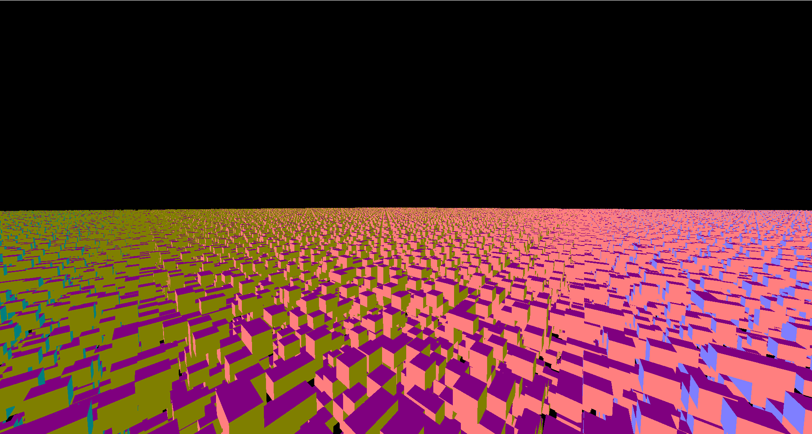

# Voxel Engine using Ray-Box splatting

This is an implementation of the A Ray-Box Intersection Algorithm and Efficient Dynamic Voxel pipeline, mainly referencing the Ray-Box implementation by [kosshi-net](https://github.com/kosshi-net/voxplat) but written in C++.

The chunk system is currently a 16x16x16 flat array containing uint_8ts referencing an index in a global block info palette, loaded via json.

Each chunk is rendered individually, with each solid block given a u8vec3 for position within the chunk and a uint32_t for color from the palette.

Below is the engine rendering roughly 26 million untextured cubes on a RTX 3070 at 75 fps without any lod or culling.

